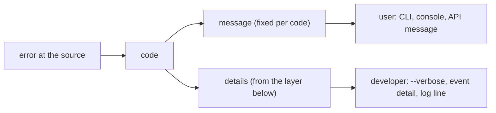

# Three audiences, three registers

Every sentence a Latere product emits or carries is written for exactly one
of three readers, and the register follows the reader, never the writer. A
spec names which register each surface uses; a review that finds a
developer sentence on a user surface fails the change.

This is the platform-wide statement of the rule. It ships in `pkg` because
every product depends on this module, so the rule travels with the code.
A repository's `CONTRIBUTING.md` points here rather than restating it.

## The rule

| Reader | Surfaces | Register | Example |
|---|---|---|---|
| User: a person or a coding harness using the product | CLI output and `--json` `message` and `hint` fields, API error `message`, console and web copy, error pages, manifest or config validation shown to users, agent skills, user docs | short, plain, says what happened and what to do next in the user's terms; names a command or a page, never a package, a function, a table, an internal identifier, or a Kubernetes object; the machine identifier travels in a `code` field, not in the sentence | `This project already has a deploy running. Wait for it or pass --supersede to replace it.` |
| Contributor: someone changing the product | specs, `CONTRIBUTING.md`, package documentation, commit messages, source comments | precise, in the project's own terms and the names the code uses, explains why a design is what it is | `The route flip is one transaction so the edge never observes a deploy that is live without a current pointer.` |
| Developer: someone debugging a running system | logs, traces, events, startup failures, internal API errors, diagnostic commands | exact and complete: the object, the operation, the observed value, the expected value, and the underlying error, with identifiers and paths in full | `apply Deployment insula-p-3f2a/api: admission denied: pods "api-7d9c" is forbidden: violates PodSecurity "restricted:latest": privileged` |

When writing a sentence, ask who reads it, then write for exactly that
reader. A sentence that tries to serve two readers serves neither: the user
cannot act on the detail, and the developer cannot debug from the summary.

## Errors: one code, one sentence, one detail

The registers do not leak into each other by construction. An error has:

- one `code`, a stable machine identifier chosen when the error is defined;
- one user sentence, fixed when the code is defined, carried in `message`
  (and `hint` when there is a next step worth its own field);
- one developer detail, carried in a separate field (`details` in an API
  envelope, `detail` in an event, the log line) that a CLI or console shows
  only on request.

The same code yields the same sentence everywhere. The sentence never
interpolates the underlying error, because the underlying error is written
for the developer and would change the register of the whole field.



A code table in a spec is where the user sentences live. A test asserts
every code has one, so a new code cannot ship with an empty or improvised
sentence.

```json
{
  "code": "deploy_in_progress",
  "message": "This project already has a deploy running. Wait for it or pass --supersede to replace it.",
  "details": "deploy create project=p-3f2a: active deploy d-91c0 (state=building, started 2026-09-06T10:41:07Z) blocks insert"
}
```

## The same failure, three ways

Each example is one failure. The three sentences are not translations of
each other: each carries what its reader needs and nothing the other two
need.

### A missing configuration key

User, CLI output for code `manifest_missing_runtime`:

> The manifest has no `runtime`. Add `runtime: go` or `runtime: node`, then run `latere deploy` again.

Contributor, in the spec:

> Validation runs over the parsed manifest before any network call, so a missing key fails in the CLI and never reaches the API. The required keys are the manifest schema in spec 008; a new key is added there first and the validator reads the schema.

Developer, in `details` and the log:

> manifest validate /work/app/latere.yaml: key "runtime" missing at top level (present: name, routes); schema v2 requires runtime in {go, node, python}

### A deploy that is already running

User, code `deploy_in_progress`:

> This project already has a deploy running. Wait for it or pass `--supersede` to replace it.

Contributor:

> A project holds at most one active deploy. The API answers 409 with code `deploy_in_progress`; `--supersede` sets `superseded_by` on the old row inside the same transaction that inserts the new one, so no reader observes two current deploys.

Developer:

> deploy create project=p-3f2a: active deploy d-91c0 (state=building, started 2026-09-06T10:41:07Z, worker build-2) blocks insert; unique index deploys_one_active_per_project

### A rejected upload

User, code `upload_too_large`:

> The file is larger than 25 MB, which is the upload limit. Compress it or split it, then upload again.

Contributor:

> The limit is enforced with `http.MaxBytesReader` on the ingress handler, so a body is refused while it streams rather than after it is buffered. The value is one constant shared by the API and the console's pre-flight check, so the two cannot disagree.

Developer:

> upload reject org=o-8812 file="dataset.parquet": body 41943040 bytes exceeds max 26214400 (MaxBytesReader); request 7f3c9a; client 203.0.113.9

### An authorization failure

User, code `forbidden`:

> You do not have permission to delete this project. Ask an owner of the organization to give you the project admin role.

Contributor:

> Authorization is decided once per request in the middleware, from the token's scopes and the organization membership. Handlers never consult the store for permissions, so a scope added to the registry is enforced everywhere the moment a route names it.

Developer:

> authz deny subject=user_a1b2 org=o-8812 action=project.delete resource=p-3f2a: token scopes [project:read project:write] lack project:admin; membership role=member; scopes registry v14

### A storage outage

User, code `storage_unavailable`:

> Files are unavailable right now. Nothing was lost. Try again in a few minutes.

Contributor:

> Every object-store error maps to the one code `storage_unavailable` and a 503 with `Retry-After`. The circuit breaker opens after five consecutive failures so the API stops paying the full timeout on every request while the store is down.

Developer:

> s3 GetObject bucket=latere-drive-eu key=o-8812/f-19a3/v2: dial tcp 10.4.0.12:9000: i/o timeout after 10s (attempt 3/3); breaker open since 2026-09-06T10:41:07Z

## Tells that a sentence is in the wrong register

On a user surface:

- a Go import path, a package-qualified identifier, a type name, or a
  function name (`internal/api.WriteError`, `pgx.ErrNoRows`, `*store.Deploy`);
- a Kubernetes kind and object name, a table or column name, a file path,
  a container image, a host and port;
- an internal code or identifier inside the sentence (`error E1042:`, a
  UUID, a request id); these belong in `code` or `details`;
- the underlying error interpolated into the sentence, so the same code
  reads differently on each occurrence;
- a hint with no action (`check your configuration`, `contact support`
  with no page or command named);
- `something went wrong`, which says nothing on any surface.

On a developer surface:

- `please`, `oops`, `sorry`, or any other address to a person's feelings;
- an operation with no object, or an object with no observed and expected
  value (`failed to apply deployment`);
- an error wrapped without the identifiers the next reader needs (`context
  deadline exceeded` with no host, no key, no attempt count).

On a contributor surface:

- a commit message written as release notes for users, or a changelog
  entry written as a description of the diff;
- a spec that says what without saying why;
- second person addressed at a user (`you can now`) in a spec or a source
  comment.

## How to review for it

1. For every new or changed sentence in a diff, name the surface it lands
   on and the reader of that surface. If the surface is not in the table,
   add it to the repository's `CONTRIBUTING.md` under the reader it serves.
2. Read the sentence against the tells above for that reader.
3. For an error: confirm the code is defined once, the sentence is fixed
   beside the code, the developer detail travels in a separate field, and a
   test asserts the code has a sentence.
4. Where to look: string literals passed to the functions that write user
   output (the API error writer, the CLI's error and hint printers), i18n
   dictionaries, templates and error pages, skills, user docs; `slog` calls
   and error wrapping for the developer register; specs and commit messages
   for the contributor register.
5. A finding is fixed by moving text between fields, not by softening the
   developer detail or by padding the user sentence.

The most common leak, a package path, a package-qualified identifier, a
Kubernetes object, or a file path inside a string handed to a user-surface
function, is checked mechanically by the `registers` gate in
[`latere.ai/x/ci-gate`](https://github.com/latere-ai/ci-gate) once a
repository names its user-surface functions in `.lateregate.yaml`. The
gate catches the mechanical tells; the review catches the rest.
